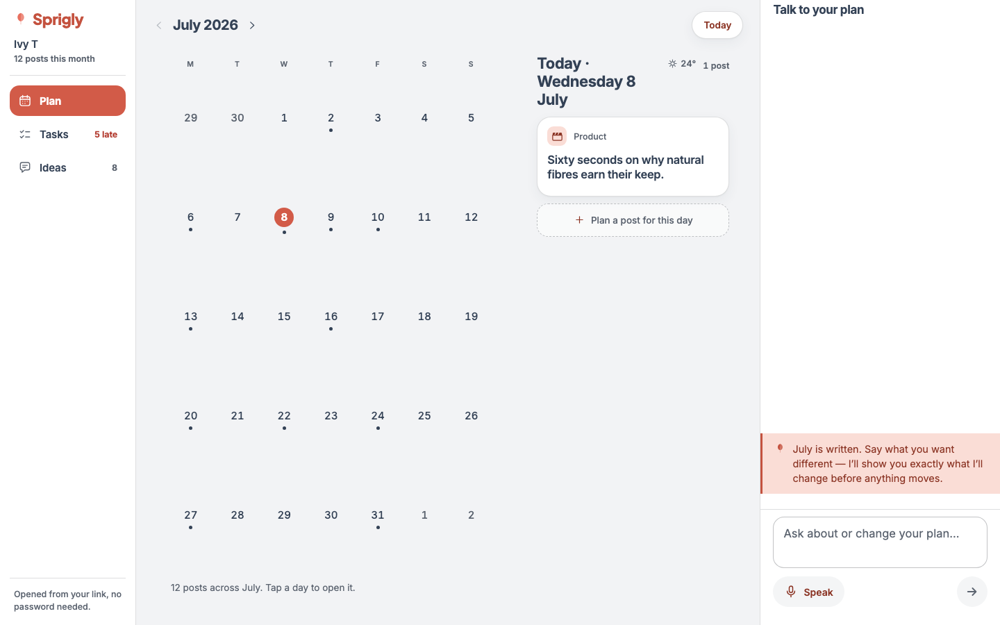
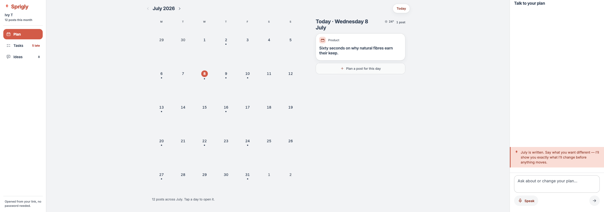
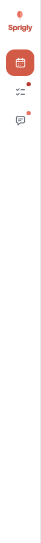
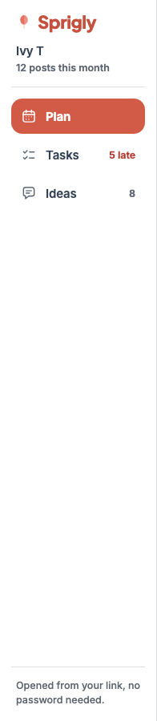

# Desktop polish 2 — chrome, and where a question goes

**Branch:** `dev` · **Commits:** `795bcc0` (F1), `f962563` (F2), `9e273e3` (F3), `355e1ea` (F4/F5), plus this report.
**Evidence:** five operator screenshots, 3 August.

Five findings. One of them — F2 — was a missing distinction rather than a bug, and it took the
longest to fix properly because the obvious fix would have broken something worse.

---

## Summary

| | Finding | Outcome |
|---|---|---|
| **F1** | Another client's product in every composer | **Fixed**, plus three more places nobody had reported |
| **F2** | Questions about the plan filed as new ideas | **Fixed at the routing layer**, before any model call |
| **F3** | Summary foot buttons dead on desktop | **Fixed** — the dock was never listening |
| **F4** | Chrome seams; the dock still a floating card | **Fixed** — the shell meets the viewport at every width |
| **F5** | The wordmark vanishes when the rail collapses | **Fixed** — it stacks under the mark |

---

## F1 — the placeholder

The composer read **"The Wilderness candle relaunches on the 24th…"** — a real Earl of East
product — on every client's surface. The operator caught it on ivy-t's, where the only available
reading is that we have shown them another brand's plan.

A placeholder is a worked example, and a worked example built from one client's catalogue cannot
be shown to another. The replacements are month-aware rather than product-aware: they demonstrate
the *shape* of a useful sentence without borrowing anyone's inventory.

| Context | Was | Is |
|---|---|---|
| Draft | "The Wilderness candle relaunches on the 24th…" | **"Tell me what's happening in September…"** |
| Committed | "Move the Thursday post to Friday" | **"Ask about or change your plan…"** |

The committed one leads with *ask* because asking is now something this composer does (F2). The
old text offered one verb and one shape, and taught the composer as a command line.

### The grep, and what it found

Searched `app/src` for every rendered string carrying a client's or product's name
(`wilderness|earl of east|ivy-t|sally|butterfly|hannah|linen shirt|corduroy|tote bag|mocha`),
then read every `placeholder=` on a client-facing surface.

**Rendering another client's catalogue — four, three of them unreported:**

| File | String | Status |
|---|---|---|
| `surface/VoiceSheet.tsx:84` | "The Wilderness candle relaunches on the 24th…" | the reported one — **fixed** |
| `plan/DraftPlanView.tsx:300` | "e.g. the Wilderness candle relaunches on the 24th" | **fixed** — pre-redesign draft surface, still reachable |
| `surface/AddSheet.tsx:109` | "The Wilderness candle, back in stock" | **fixed** → "A restock, an event, a story you want told" |
| `PlanApp.tsx:606` | "Make it softer · shorter · warmer · **more about the fabric**…" | **fixed** → "…more specific…" |

The last is the same mistake one size down: "the fabric" assumes a clothing brand, and a candle
maker reading it on their own editor is being shown someone else's vocabulary.

**Checked and clean:** `IntakeCapture`'s multi-line PLACEHOLDER ("Big launch on the 25th", "A
sale the last weekend of the month" — shapes, no products), its durable-item field, `PlanApp`'s
change input ("Move the Tuesday post to Friday · …"), and `DetailSheet`'s refine field ("Warmer,
and mention the relaunch earlier" — a category noun, nobody's product).

**Every remaining `Wilderness` hit in `src` is a code comment** (`card-text.ts`,
`draft-rationale.ts`, `types.ts`, and the new note in `VoiceSheet.tsx` recording the bug). No
client reads a comment; they are documentation of real cases and were left alone.

**The regression test inverts the old one.** The test that used to pin this asserted "the one
example each context is allowed" — and was checking for the candle *by name*. It now asserts a
word list (`wilderness`, `candle`, `earl of east`, `ivy`, `sally`) appears in **neither**
placeholder, so the next example built from whatever data is to hand fails there rather than on
a client's screen.

---

## F2 — questions about the plan

> *"What ideas of mine are integrated into this month"* — filed as a new idea. Four phrasings,
> four new ideas, no answer.

### Why it happened

`classifyIntake` split every utterance on one axis: **is this about this month, or is it for
later?** It decided with topic words and datelessness — "ideas", no date, therefore a standing
idea for the backlog. A question is not on that axis at all, so the catch-all caught it. A client
asking what we did with their input was answered by us recording that they had said it again.

### The rule, as implemented

`parsePlanQuestion` (`packages/engine/src/intake-classify.ts`) is a **deterministic pre-parse**,
sitting beside the typed-calendar-row one and **before any model call** — because whether a
sentence is a question is a fact about its grammar, not a judgement about its content, and a
judgement is what went wrong.

> **Three gates. All three must pass.**
>
> 1. **It is interrogative** — a `?`, or a leading wh/auxiliary word (`what which why when where
>    who how is are do does did can could will would should has have`), or an indirect opener
>    (`tell me…`, `show me…`, `remind me…`, `list…`).
> 2. **It is about the plan or its inputs** — a topic word: plan/month/post/schedule/calendar,
>    idea/input/note/suggestion, reel/carousel/caption/beat/series/launch/pillar, a weekday, a
>    month name, or a bare ordinal. **Dates count**: this composer is only ever pointed at a
>    plan, so *"is there anything on the 14th?"* is about the month.
> 3. **It is NOT a request in question form** — and this gate runs **first**.
>
> `kind` is `'ideas'` when the sentence is about the client's own contributions (`idea`, `input`,
> `note`, `suggestion`, "I told you", "of mine"), and `'plan'` otherwise.

**Gate 3 is the one that matters most.** Half of every reshape is phrased as a question — *"can
we move the Friday post?"*, *"could you make the 3rd a carousel?"* — and routing those to an
answerer would be a far worse regression than the bug being fixed: the client would be *told
about* their month instead of changing it. An action verb aimed at the plan means **do it**,
whatever the punctuation.

**Every gate fails closed.** A false negative costs nothing — the sentence goes to the model,
exactly as before. A false positive stops a client changing their month.

`IntakeRouting` grows a third scope, `{ scope: 'question', kind }`. `routeFromParsed` is narrowed
to `ModelRouting` (which excludes it), because a question is decided before the model is asked
and saying so in the type keeps every existing `routing.intent` read narrowing correctly.

### The answers are computed, not narrated

`app/src/lib/plan-answers.ts`. Both answerers are pure derivations of rows the surface already
renders — **no model call on either path.**

- **Ideas** reads the same `lifecycle` states the Ideas view derives from and the month summary
  counts with `fromClient`, scoped to the cycle on screen (`usedInCycleId`, not a rendered month
  name — matching on a label would break the first time its format changed). It names each idea
  **in her words** and the beat it became.
- **Plan** is the month's own beats, read back. A draft has no captions and no knowledge bank:
  its entire content *is* the beats, so narrating them through a model could only add words that
  are not facts.

A model here would produce a fourth account of the same rows, in prose, able to be wrong in ways
the other three cannot. The one thing worse than not answering a client's question is answering
it with an invented number.

`datesNamedIn` resolves bare ordinals and **deliberately not "next week"** — that depends on
today rather than on the month on screen, and getting it wrong is the exact bug X1a was raised
for. Unresolved simply widens the answer to the whole month, which is honest.

**A question receipt does not become the surface's receipt, and draws no summary chip.** A
receipt records a change and offers a review of it; an answer changed nothing, and its place is
the thread where it was asked.

### The fixtures

**The four phrasings, verbatim from the screenshot** — each answered with the integrated ideas
and their beats, in the browser, and each asserting `GET /api/plan/ideas` returns the **same
count afterwards**. That last half is what the bug would have failed silently.

| Fixture | Routes to | Verified |
|---|---|---|
| "What ideas of mine are integrated into this month" | `ideas` | unit + e2e ✅ |
| "Which of my ideas made it into September?" | `ideas` | unit + e2e ✅ |
| "Have any of the things I told you been used this month?" | `ideas` | unit + e2e ✅ |
| "Show me the ideas you used in this month's plan" | `ideas` | unit + e2e ✅ |
| **"add an idea about winter layering"** | intake (files) | unit + e2e ✅ |
| **"what's planned next week"** | `plan` (answers) | unit + e2e ✅ |
| 8 requests in question form ("can we move the Friday post?" …) | intake/transforms | unit ✅ |
| 6 statements ("more product this month", "make Fridays more personal") | intake | unit ✅ |

**29 routing tests · 15 answer tests · 16 e2e across both projects.**

One test was rewritten after the fact, and it is worth recording: I first asserted that *"Tell me
about the launch on the 24th"* fell through, because there was no wh-word after "me". That was
pinning a limitation, not a rule — someone asking to be told about their launch wants to be told
about their launch. It answers now, and the mirror case (*"We are launching the candle on the
24th"*) still files.

---

## F3 — the summary's foot buttons

The assumption row and *"Not right? Tell us what to change"* did **nothing** on desktop. Two
visible controls, no feedback, no error.

Both called `setVoiceFor`, which on the phone opens the summoned sheet **and** points it at the
question — one act, served by one mount-time effect behind a `historyLoaded` guard. The desktop
**dock is never summoned**: it has been open since the page loaded, that effect had already run,
and both buttons were changing a prop nobody was listening to.

**`focusSignal` is a counter, not a flag**, and that is the whole fix. A boolean would already be
true the second time a client taps "tell us what to change" — tap, get interrupted, tap again —
and the second tap would be as dead as the first was. On the signal, the sheet appends the
question as an agent turn if it is new and puts the cursor in the field. It is keyed on the
signal **alone**: re-running on `question` would re-append the same turn on any unrelated
re-render, and a thread that repeats itself reads worse than one that misses a line.

The phone gets the signal too. It does not need it — one behaviour across both frames beats two
paths that happen to agree.

**Ten tests, five per frame**, asserting what a client would notice rather than that a click
happened: the composer takes focus, the question arrives as a turn, the double-press works, the
turn is not duplicated by re-renders, and **the request body is identical on both frames**. That
last one is the point — a surface can look right and send something else, and the phone's path is
the one that already worked, so the desktop's is held to *its* shape:

```
{ op: 'text', text: 'Nothing is launching in October', source: 'web' }
```

---

## F4 — the chrome seams

Three faults compounding into one: borders down both edges of the app, the rail and dock not
flush with the viewport, and the dock container still a floating card.

**W3 flattened the turns inside the dock and left the panel holding them a card** —
`rounded-[20px]`, a border, a shadow. The seam moved rather than went. `Panel` is flat now, and it
is the same argument one level up: **a panel is a region of the shell, not an object resting on
it.** The fill change from canvas to surface is the whole separation it needs.

**The shell's ceiling moved down a level rather than going.** W1 capped the whole shell at 1764
and centred it — which stopped the columns growing, the right goal — but at 2560 it put the
rail's left border and the dock's right border 400px inside the viewport with canvas either side.
The app read as a bordered rectangle floating in a field.

> Both rules hold at once now. The **shell is full-width** and its two edge regions are flush; the
> ceiling lives on the **columns** (`max-w-cols` = 680 + 20 + 420 + gutters = 1168), which centre
> in whatever is left between rail and dock. The columns still stop at 680/420, the surplus is
> still balanced on both sides of them — W1's rule, unchanged in substance — and it is now inside
> the app instead of around it.

The header rides the same measure, or the month title would sit a long way from the grid it names.

### Measured

| Width | Shell L/R | Rail L | Dock R | Columns | Balanced ± | Panel radius / border / shadow | Overflow |
|---|---|---|---|---|---|---|---|
| 1024 | 0 / 0 | 0 | 0 | 636 | — (stacked) | 0px / 0px / none | no |
| 1440 | 0 / 0 | 0 | 0 | 898 | 0 | 0px / 0px / none | no |
| 1920 | 0 / 0 | 0 | 0 | **1168** | ≤1px | 0px / 0px / none | no |
| 2560 | 0 / 0 | 0 | 0 | **1168** | ≤1px | 0px / 0px / none | no |




---

## F5 — the wordmark and the collapsed rail

At 68px the rail cannot hold "Sprigly" beside the leaf at 22px — the word is about 75px — so the
identity was clipped or spilling over the month grid depending on where the overflow landed.

It **stacks under the mark at 12px** now and fits with room. The mark keeps its 20px, so the
identity reads at the same weight either way. An app that drops its own name when the navigation
narrows has decided the name was decoration.

| | Rail | Word | Size | Inside the rail | Arrangement |
|---|---|---|---|---|---|
| Collapsed (1024) | 68px | "Sprigly" | 12px | ✅ | stacked under the mark |
| Expanded (1440) | 196px | "Sprigly" | 22px | ✅ | beside the mark |




---

## Gates

| Gate | Result |
|---|---|
| App unit + interaction (Node 22) | **1430 passed, 38 skipped** |
| Engine | **573 passed** |
| Playwright, all projects | **126 passed, 2 skipped**, 1 flaky (mobile `conversation.spec.ts`, pre-existing, passed on retry) |
| Playwright `desktop` | **32 passed** |
| `tsc --noEmit` (app, engine) | clean |
| Fences — draft-invisibility, tokens, terminology | all pass; `git diff` on each **empty** |
| Hex literals in changed components | **zero** |
| Design detector | **0 findings** (`Panel`, `DesktopShell`, `Rail`, `PlanShell`, `VoiceSheet`, `DraftSurface`) |
| `pnpm --filter @sprigly/worker... build` | clean |

E2E went **110 → 128** tests. The two pre-existing collect failures (`edit-scope.test.ts`,
`post-generation.test.ts`, both on a missing `DATABASE_URL` at import) are unchanged.

**One consumer outside the app needed the new scope**: `engine/src/content-cycles/
classify-check-cli.ts`, the operator's classification-check tool, now prints `question/ideas`
instead of failing to compile. Caught by the worker build, which is why it is in the gate list.

---

## Noted, not fixed

1. **The month summary's answerable row is desktop-and-mobile identical now, but only one
   assumption is ever offered.** That was a deliberate M4 decision (asking a client three things
   at once is a different act from asking one) and this session did not revisit it.
2. **`max-w-shell` is retained in the theme** though the shell no longer uses it: the spec's §2.6
   arithmetic is stated in terms of it. §2.6 should be updated to describe where the ceiling
   actually lives now — a docs change this session did not make, since the brief scoped the
   report to `desktop-polish-2.md`.
3. **The committed-month agent path was not changed.** It already routes questions to a `query`
   action with its own answerer, and the reported failure was on the draft path
   (`applyTextToDraft` → `saveToBacklog` is the only thing that "files a new idea"). If the same
   phrasings misroute on a committed month, that is a second fix in the task parser's prompt and
   wants its own evidence.
