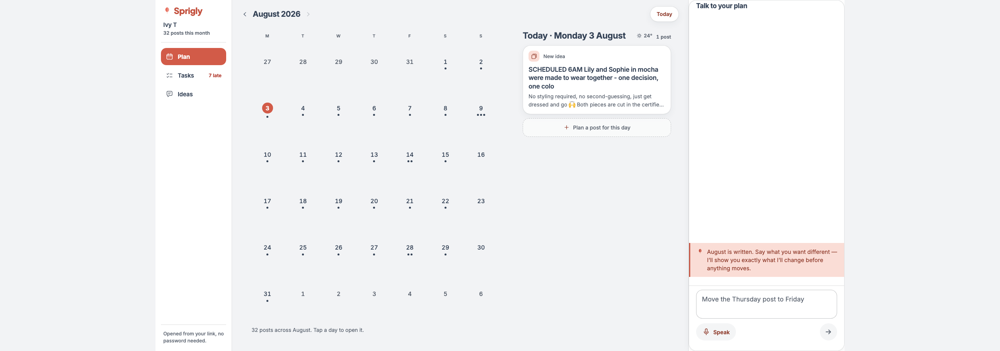
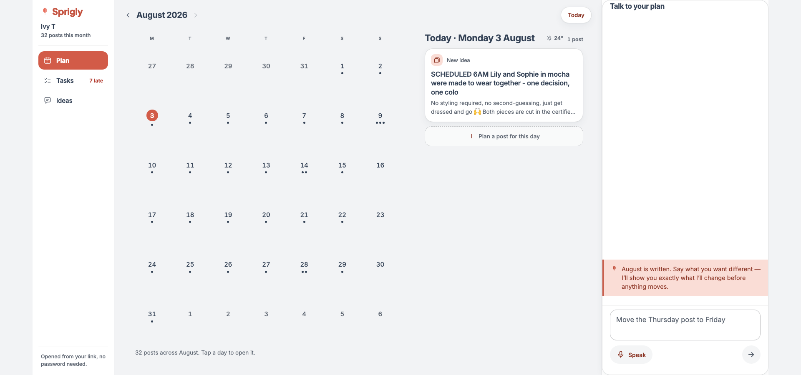
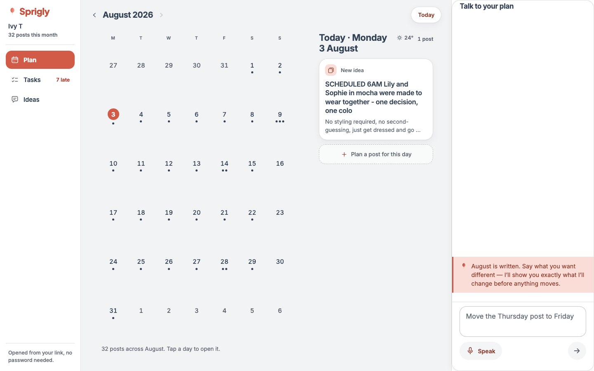
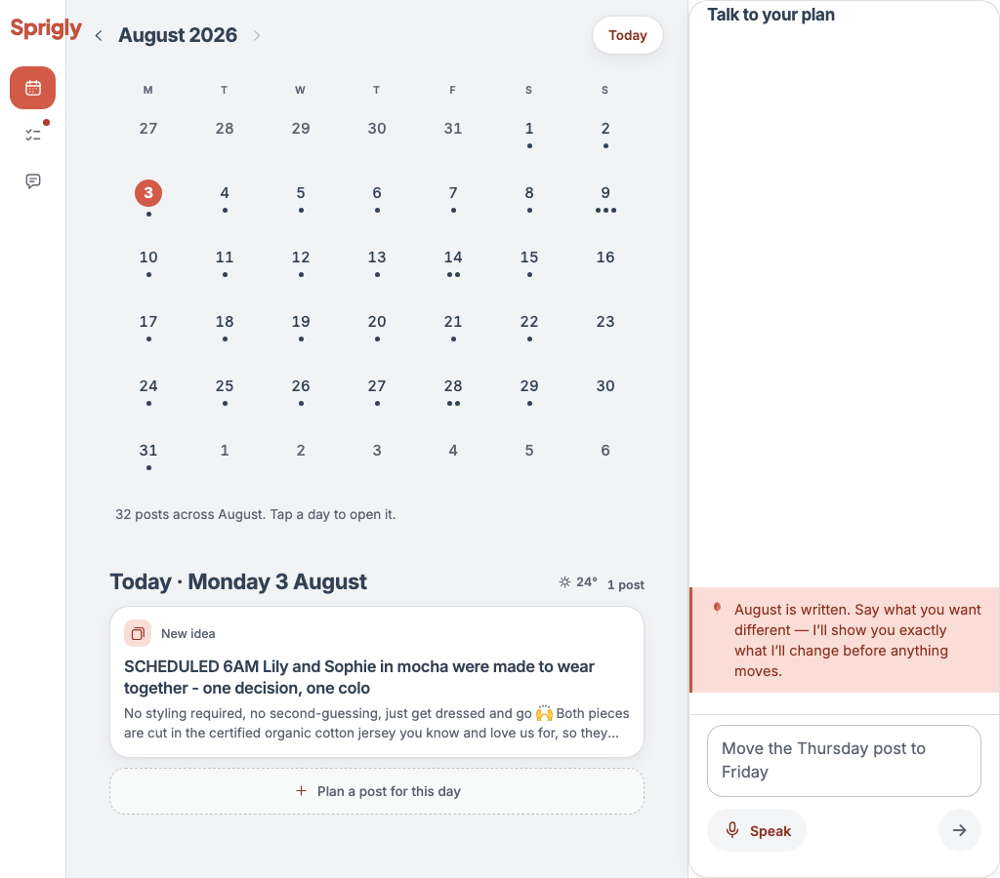
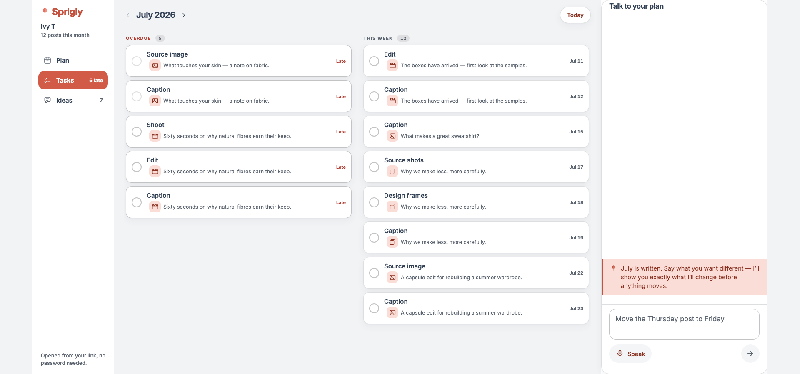
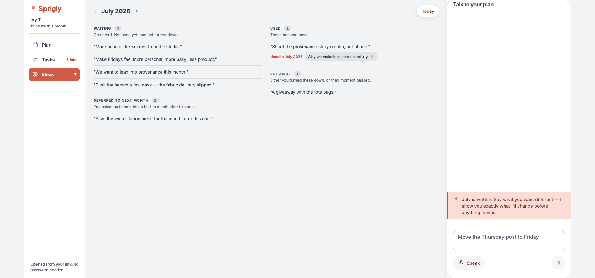
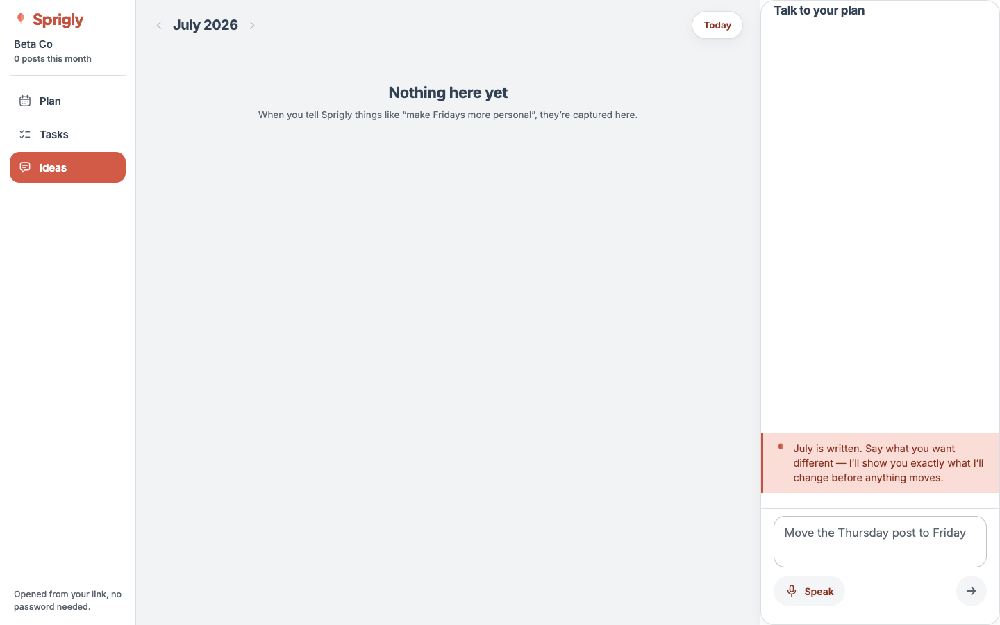

# Desktop plan surface — the refinement session

**Branch:** `dev` · **Commits:** `8e2ec6c` (W1), `4316241` (W2/W3/W4), `6790400` (W6), `742bc0c` (W6 refinements), plus this report and the spec update.

The operator reviewed the build on a ~2560px monitor. The build was designed at 1440, and above
that width it did not scale — it *stopped*. Everything below either fixes that or answers a
question the review raised.

One item, **W5**, turned out not to be a defect. It gets the longest section anyway, because
"nothing is wrong" is worth exactly as much as the evidence behind it.

---

## Summary

| | Item | Outcome |
|---|---|---|
| **W1** | Width strategy above 1440 | **Fixed.** Proportional growth to a ceiling, then the shell centres. Measured at 1024/1440/1920/2560 |
| **W2** | Generate confirm as a centred modal | **Fixed.** `Modal` is the third frame in the Panel pattern |
| **W3** | Dock chrome flush at the edges | **Fixed.** Measured: left gap 20 → 2px, right 51 → 1px, radius 14 → 0 |
| **W4** | Tasks at width | **Fixed.** Owns the plan region, flows into two columns. Also fixed a dead end it shipped with |
| **W5** | Verify the month count | **Not a defect.** Four independent lines of evidence, plus a regression test |
| **W6** | Ideas (Notes' successor) | **Built.** Read-only, four derived states, tap-through to the beat |

**iPad (1024) was reported acceptable and is undisturbed** — the middle band's stacked layout,
collapsed rail and 320px dock are unchanged. It is now in the tested set at every gate.

---

## W1 — the width rule

### What was actually wrong

The spec's breakpoint table stopped at "≥ 1280px", which describes a *design* rather than a
*behaviour*. Above 1440 the columns held their pixel values and the shell grew a void: at 2560
the plan occupied the left 1440 and 1120px of canvas sat empty to the right of it.

**The rule, now stated in `docs/design/desktop-plan-surface.md` §2.6:**

> The columns grow in proportion to a stated ceiling. Then the shell centres.
>
> 1. **Month : day = 680 : 420** — a ratio, not two fixed widths, so 1440 falls out as the
>    reviewed layout rather than being special-cased.
> 2. **Dock = `clamp(320px, 24vw, 400px)`** — it is a reading column for a conversation, and a
>    conversation does not read better at 700px.
> 3. **Shell caps at 1764px and centres** — the sum of every region at its ceiling. Beyond that
>    the margins grow equally on both sides.

Every value is named in the Tailwind theme (`max-w-shell`, `w-dock`, `flex-month`, `flex-day`,
the `wide` screen) rather than written as an arbitrary length — so the tokens fence, which bans
`w-[Npx]` over 280, passes unchanged and there is one place to change any of them.

### Measured, in a browser, against real prod data

| Width | Shell | Left margin | Right margin | Month | Day | Dock | Rail | Overflows |
|---|---|---|---|---|---|---|---|---|
| 1024 | 1024 | 0 | 0 | 588 | 588 (stacked) | 320 | 68 | no |
| 1440 | 1440 | 0 | 0 | 513 | 317 | 346 | 196 | no |
| 1920 | **1764** | **78** | **78** | **680** | **420** | **400** | 196 | no |
| 2560 | **1764** | **398** | **398** | **680** | **420** | **400** | 196 | no |

1440 reproduces the reviewed layout within 3px (reviewed: 512 / 320). The ceilings are reached
at 1920 and hold; the margins are equal at both wide sizes. Nothing overflows sideways anywhere.

### Two bugs the rule uncovered

**A clipping band nobody had looked at.** Side-by-side started at `xl` (1280), where the fixed
columns needed 852px of a 692px content box inside an `overflow-hidden` parent. **Every width
from 1280 to 1439 clipped the day column**, and no test covered the band. The switch moved to a
named `wide` breakpoint at 1440. The middle band is therefore **1080–1439**, not 1080–1279.

**The month grid was two-fifths full.** The cells were `aspect-square`, so at a grown column
width the grid wanted to be taller than the space it had. On desktop the rows share the
available height with a 64px floor; the phone's square geometry is untouched. An e2e test now
asserts the grid fills more than 90% of its column.

---

## W2 — the Generate confirm is a modal

A full-width bottom sheet is a phone shape. At 1764px it was a wall carrying three counts and
two sentences.

`Modal` is the third frame in `Panel.tsx`, beside `Sheet` and `Panel` — one component inside,
three frames, which is the pattern D3 established. **It is deliberately not a `Panel`.** The
approval spends money and writes a month of content, so it keeps everything a panel drops: the
scrim, the focus trap, `role="dialog"`, `aria-modal`, the browser theme band. It differs from
`Sheet` only in shape — a centred 480px box. The width is fixed rather than proportional
because the decision it carries is exactly the same size on every screen.

**Evidence, and a gap I am naming rather than papering over.** The modal's geometry, its
`aria-modal`, its scrim, and its counts / consequence line / two actions are covered by jsdom
interaction tests; an e2e test asserts the sheet form never renders on the desktop shell. **There
is no browser screenshot of the modal**, because neither the e2e seed nor the copied prod client
has a month in draft, and the approval is only reachable from a draft. Building a draft fixture
is a real piece of work and outside this brief — it is listed under *Deferred* below.

---

## W3 — the dock's turns are panel-native

A rounded card inset from both sides is a phone treatment: it floats over a sheet that floats
over the month. In a dock the turn is not floating over anything — it *is* the panel — and a
card inset from edges it already has reads as a component borrowed from elsewhere.

Agent turns and interpretation turns bleed to the dock's edges now (a negative inset against
the thread's own gutter, padding put back inside) and keep the one thing that makes them the
agent: the accent left edge and the mark. **The client's bubble stays a bubble**, because that
contrast is what makes a thread readable.

Measured in a browser at 1920, before and after:

| | Left gap | Right gap | Corner radius |
|---|---|---|---|
| Before | 20px | 51px | 14px |
| After | **2px** | **1px** | **0px** |

The right gap of 51px is worth noting on its own: the turn was not merely inset, it was inset
*asymmetrically*, and nothing on the screen explained why.

**The thread also grows from the composer upwards now.** On a 92%-height sheet that is barely
visible. In an 800px dock, turns pinned to the ceiling with 500px of white beneath them was the
loudest "unfinished" signal on the screen.

---

## W4 — Tasks owns the region

It was rendering into the **day** column: a checklist laid out at 420px with 680px of empty
month beside it — the marooned-mobile-column shape the brief names.

`DesktopShell` grew a `region` slot that replaces both columns, and the sections flow into two
columns at `wide`. CSS multi-column rather than a grid, because the sections are different
heights and a grid would align their tops and leave ragged gaps.

Measured at 1920: panel **1120** of a **1168** region, **2** columns, day column absent.

**A dead end it shipped with, found by W6 and fixed here.** The detail panel renders into the
day column, and `region` replaces both columns — so tapping a post from Tasks set the state and
changed *nothing on the screen*. A control that visibly does nothing. `openFromRegion` returns
to the plan as well as setting the id, which is also the right answer rather than the convenient
one: opening a post is a plan act, and that is where every other route into a post lands. Both
jsdom and e2e now assert it.

---

## W5 — the count is correct, and here is the proof

> *"the committed August view shows '17 posts across August' for a month holding 29 live posts
> on prod."*

**The derivation is right. The two numbers come from two different databases, and neither of
them is 29-vs-17 in the way it looks.**

### The rule the surface follows

**The count is the MONTH's, not the cycle's.** Every live post *dated* in the displayed month,
whichever cycle owns it. A post the viewed cycle owns but which was moved out of the month is
not counted — it appears in the "Outside this month" strip instead. A post another cycle owns
that was moved in, is.

The trap underneath it: **`cycle_month` sits one month behind the month it displays**
(`displayMonth = nextMonth(cycleMonth)`). A cycle whose `cycle_month` reads `2026-07` is the
**August** plan.

### Four independent lines of evidence

1. **Static trace.** `loadPlanPosts` (viewed cycle, any date, draft-fenced) ∪
   `loadCrossMonthPosts` (other cycles, dated in month) → `calendarPosts`, filtered to the
   month. Correct as written.
2. **SQL against prod.** For the client and cycle in question: **31 live posts dated in August,
   plus 1 cross-month = 32.**
3. **A test over the real dates.** The 31 actual prod August dates fed through the derivation:
   31 in, 31 out. Cross-cycle posts count; out-of-month posts do not.
4. **Reproduced in a browser** against a read-only copy of that client's prod rows: the surface
   rendered **"32 posts across August"** — matching (2) exactly.

### Where the 17 came from

**UAT, not prod.** On `.env.local` (a live Railway UAT environment) three cycles share
`cycle_month = 2026-07`. One of them holds exactly **17** posts — and 17 is genuinely *all* of
that client's August-dated posts in that cycle. The **29** the operator counted belong to cycle
`d502f22d`, whose `cycle_month` is `2026-06` and which therefore displays as **July**.

Two cycles, two months, two correct numbers, read as one wrong one.

### What was done about it

**Explained, not "fixed" — there was nothing to fix.** What was added is a regression test
(`month-count.interaction.test.tsx`, 6 cases) that pins the rule rather than leaving it to be
re-derived from three files: the real 31 August dates counting to 31; a cross-cycle post
counting; an out-of-month post *not* counting; both frames producing the identical string; an
empty month saying so in words rather than printing a zero; and the rail's subtitle agreeing
with the footer.

**The same derivation runs on mobile** — it is computed once and handed to whichever shell is
rendering, so a client cannot get one answer on a phone and another on a desktop. That is one
of the six tests.

### One inconsistency observed, deliberately not fixed

`loadPlanPosts` does not filter by channel; `loadCrossMonthPosts` does. In theory a
channel-mismatched post in the viewed cycle would count while the same post in another cycle
would not. **There are zero such posts in prod or UAT.** It is one sentence in a report, not a
change to a loader that is currently correct for all live data.

---

## W6 — Ideas

### What Notes was missing

`PlanDesktop` had a Notes view: a column of things the client had said, in order, and nothing
else. The desktop rebuild dropped it on the argument that the conversation thread is already the
record of what was said — true, and the smaller half of the question. Someone who says *"make
Fridays more personal"* in July is not asking to be shown their own sentence back in September.
They are asking **whether it ever became anything.**

### The state is derived, never stored

`plan_inputs` carries two columns that are deliberately not merged: `status` is **availability**
(active / integrated / expired / dismissed), `lifecycle` is **maturity** (candidate → used →
measured → proven, plus declined / stale). A `proven` idea is still `active`, so a reader
trusting either column alone gives a confident wrong answer.

That is not hypothetical. **In UAT today, fourteen rows are exactly that shape** — `active` and
`used`. A `status` reader would label every one of them "waiting", telling a client we had
ignored ideas we had already published.

| State | Derived from | Reads as |
|---|---|---|
| **Used** | `lifecycle` ∈ {used, measured, proven}, or `status` = integrated | "Used in July 2026", with a tap-through to the beat |
| **Set aside** | `lifecycle` ∈ {declined, stale}, or `status` ∈ {dismissed, expired} | "Set aside" |
| **Deferred** | `type` = next_cycle | "Deferred to next month" |
| **Waiting** | everything else | "Waiting" |

**Four states where the brief named three.** `declined` and `stale` are real values the table
holds, and neither is "waiting" — "waiting" is a promise it might still happen, and saying that
about something we turned down is the one failure this view could have that a client would
fairly call a lie.

### The two links, and why both are nullable

`used_in_cycle_id` names the **month** (through `nextMonth`, or a July idea would claim it ran a
month before it did). `beat_meta.sourceRef` names the **beat**, written by the draft assembler
when an allocation carries a candidate. They are written at different moments by different code,
so an input can carry either, both or neither, and the panel shows whatever is there.

**The tap-through cannot dead-end.** A `sourceRef` can point at a post in a month the client is
not looking at, and `onOpen` resolves ids against the loaded plan — so a button there would
visibly do nothing. Out of view, the title survives as text with no control on it.

### Read-only, and provably so

No add, no edit, no delete. The way to add an idea is to tell the agent, which already exists,
already understands *"actually, not that one"*, and already files what it hears. A second
capture surface here would be a second way to say the same thing under different rules.

**Both the jsdom and the e2e suite count every control in the whole view and assert there is
exactly one** — the tap-through — so the claim fails a test rather than rotting in a comment.

### The month summary links here

*"6 ideas you gave us in July"* is now the way in. The link is marked on the fact
(`opensIdeas`) rather than matched on its wording downstream, which would have failed the month
the count hit 1. **Desktop only**: Ideas is a rail destination and the phone has no rail, so on
mobile the line stays a statement. A link is worse than no link when it goes nowhere.

### The empty state

Kept from the old Notes verbatim, example and all. It does not say "no ideas yet" — which reads
as a failure to do something — it says what saying something *does*, and teaches the add path
by demonstrating it.

### Two things the screenshots caught that the tests had passed

**The state was said twice.** Under a "WAITING" heading, four rows each ended in the word
"Waiting". The heading carries the phrase now; a row says its own state only when it has
something to add — the month, on a used one.

**The empty state was split across the columns.** `columns-2` put "Nothing here yet" in the
first column and the sentence explaining it in the second, halfway across the screen. The flow
is off when there is nothing to flow. The jsdom test had asserted the copy was present — and it
was, in two places.

### Fixtures

The e2e seed held three identical `active`/`candidate` notes, so Ideas could only ever draw one
column. It now carries all four states plus a beat wired to the used one, which is what makes
the tap-through testable end to end. **The copied prod client has zero `plan_inputs`** — which
is why the empty state above is shot from the empty tenant rather than invented.

---

## Gates

| Gate | Result |
|---|---|
| `tsc --noEmit` (app) | clean |
| App unit + interaction (Node 22) | **1376 passed, 38 skipped** |
| Playwright, all projects | **77 passed**, 1 flaky (mobile conversation, unrelated, passed on retry) |
| Playwright `desktop` | **29 passed**, 1 flaky (ringed-days, pre-existing, passed on retry) |
| Fences — draft-invisibility, tokens, terminology | all pass; `git diff` on each is **empty** |
| Hex literals in changed components | **zero** |
| Design detector | **0 findings** across every changed component |
| `pnpm --filter @sprigly/worker... build` | clean |

**Node 22 is mandatory for the app suite.** Under the default Node 20 every jsdom file is
silently skipped while the run still reports green — 823 tests instead of 1376, with no failure
to notice.

**Two pre-existing collect failures** (`edit-scope.test.ts`, `post-generation.test.ts`) fail on a
missing `DATABASE_URL` at import time. They predate this session and are unchanged by it.

---

## Deferred — real, and not this session's to fix

1. **No draft-month fixture anywhere.** Neither the e2e seed nor any copyable prod client has a
   month in draft, so the whole draft surface — the month summary panel, the beat sheet, the
   Generate confirm — has **zero end-to-end coverage**, and W2's modal has no browser
   screenshot. This is the largest gap the session found and it deserves its own piece of work.
2. **The channel-filter asymmetry** between `loadPlanPosts` and `loadCrossMonthPosts` (W5
   above). Zero affected rows in prod or UAT.
3. **Insights is still not drawn.** The phone's ruling holds: a control that does nothing is
   worse than an absent one. Ideas took the rail's third slot with no layout change, exactly as
   the spec predicted it would.

---

## Files changed

**New:** `app/src/lib/ideas.ts` (derivation, pure) · `app/src/lib/agent/ideas.ts` (the read) ·
`app/src/app/api/plan/ideas/route.ts` (GET only, by design) ·
`app/src/components/plan/surface/IdeasPanel.tsx` · `app/src/lib/ideas.test.ts` ·
`app/src/components/plan/surface/ideas.interaction.test.tsx` ·
`app/src/components/plan/surface/month-count.interaction.test.tsx`

**Changed:** `tailwind.config.ts` (the width scale) · `DesktopShell.tsx` · `MonthGrid.tsx` ·
`Panel.tsx` · `ApprovalSheet.tsx` · `AgentVoice.tsx` · `Interpretation.tsx` · `VoiceSheet.tsx` ·
`TasksPanel.tsx` · `TaskList.tsx` · `CommittedSurface.tsx` · `DraftSurface.tsx` · `Rail.tsx` ·
`icons.tsx` · `DraftMonthSummary.tsx` · `draft-rationale.ts` · `pieces.tsx` · `usePlanData.ts` ·
`e2e/desktop.spec.ts` · `packages/db/src/seed-e2e.ts` ·
`docs/design/desktop-plan-surface.md` (§2.6 the width rule, §3.1 Ideas)
