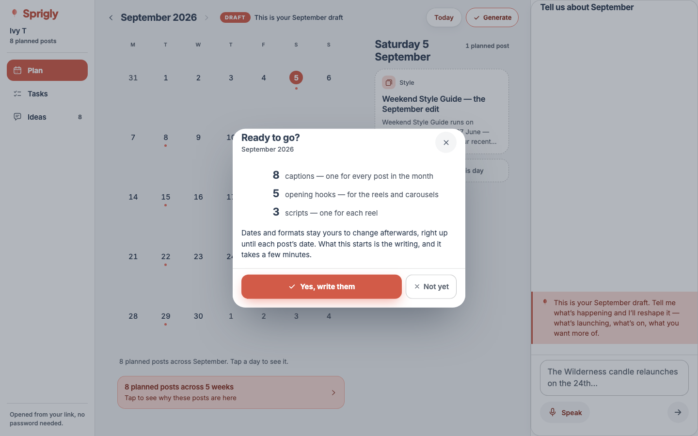
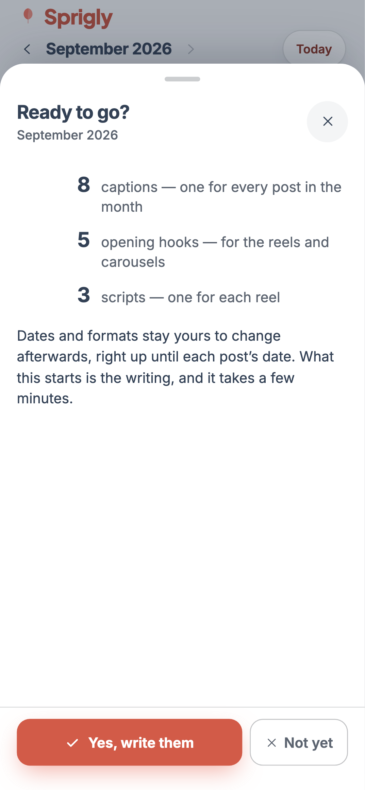

# Draft-month e2e coverage — the pre-September gate

**Branch:** `dev` · **Commits:** `c549c44` (S1 the seed), `be7d3ef` (S3 the fake), `7e19fd2` (S2 the flows + four defects), plus this report.

`docs/reports/desktop-refinement.md` deferred this as the largest gap it found: no fixture
anywhere held a month in draft, so the **entire draft surface had zero end-to-end coverage on
both form factors** — and it is the surface the September debut opens on. The Generate modal had
never been photographed from a browser.

It has coverage now: **34 tests across two new projects**, the missing screenshot exists, and the
work found **four defects** that only a draft fixture could have surfaced.

---

## S1 — the seed

`packages/db/src/e2e-draft-fixture.ts`. `DRAFT_CYCLE` is `cycle_month = 2026-08`, which displays
as **September 2026** (the plan month is one ahead of the data month), status `intake_confirmed`
— a `PRE_PLANNING_STATUS`, which is what `approveDraftCore` requires for a manual approval and
also the honest state for the fixture: the client answered, and the draft was built from it.

### Eight beats, and the mix is the real one

A fixture that exercises one provenance path proves the surface renders one provenance path.

| # | Date | Format | What it is | Evidence it carries |
|---|---|---|---|---|
| 1 | 5 Sep | carousel | **Series** | `seriesDue` with a real `lastPlanned` (27 Jun) + formatEngagement + pillarShare + cadenceBasis |
| 2 | 8 Sep | single | **Product, featured before** | `productCoverage` with `lastFeatured: 2026-05-12`, 4 mentions |
| 3 | 11 Sep | reel | **Product, NEVER featured** | `productCoverage` with `lastFeatured: null` · carries an assumption |
| 4 | 15 Sep | reel | **Backlog** | `sourceRef` → a real `plan_inputs` row, `backlogIdea` + `candidateRank`, slot `experiment` |
| 5 | 18 Sep | single | **Pillar only** | `pillarShare` + `cadenceBasis` and nothing else — the honest thin case |
| 6 | 22 Sep | carousel | **Competitor experiment** | `candidateRank.origin: 'competitor'`, no words of hers · carries an assumption |
| 7 | 25 Sep | reel | **Format engagement** | measurement leading, no product or series |
| 8 | 29 Sep | single | the month's last | pillarShare + cadenceBasis |

**Eight is a decision, not a round number.** It makes the approval arithmetic non-trivial —
8 captions / 5 hooks / 3 scripts, not 8/8/8, which a wrong implementation would pass — and keeps
a suite running two projects over it quick.

### Why it is a module, not eight inserts

Approving is destructive: the beats leave `draft` and the cycle becomes committed. Both
Playwright projects need to exercise that, against one container, with no reseed between them.
So the restore rebuilds the month from `draftBeatRows()` — **the same function the seed calls**.
A restore that instead listed the fields approval touches would be a second description of
approval, and would go stale the first time approval touched a ninth field.

### How the fixture stays honest about production rows

The brief named the hazard, and it is this project's recurring disease. Three mechanisms:

1. **Types.** `beatMeta` is typed as `BeatMeta`, so a field the assembler renames or adds is a
   compile error in the fixture rather than a silent divergence.
2. **Provenance, named.** Every evidence variant cites the assembler path that emits it.
3. **`draft-fixture.parity.test.ts` — 19 tests.** Every beat goes through the **real readers**:
   `groundingLines` (the sheet), `monthSummary` (the panel), `approvalCounts` (the confirm).

The third catches what types cannot: a field that is still perfectly typed and no longer *read*
by anything. It also asserts the **absences**, which is where a fixture rots quietest — the
pillar-only beat draws exactly `['pillar','cadence']`; the never-featured product prints no
sample count and no epoch; the competitor experiment carries no backlog line. And it is where
the e2e's expected strings come from, so a failing assertion cannot be "fixed" by pasting in
whatever the screen happened to say.

---

## S2 — the flows

`app/e2e/draft.spec.ts`, run by two new projects: **`draft-desktop`** (1440×900) and
**`draft-mobile`** (390×844). They run last, after every committed project.

**Its own session, not `?cycle=`.** `POST /api/plan/draft/approve` takes the cycle from the
session and accepts no body — correct, and it means a committed session steered here by query
string would approve the wrong month. With its own token, `resolveLandingCycleId` lands straight
on the draft because the home cycle holds a reviewable draft, which is exactly what the Ask
email's link does in production. The landing is therefore under test rather than clicked past.

### Results

| | Flow | desktop | mobile |
|---|---|---|---|
| a | Draft badge, framing, seeded count in both places it is stated | ✅ | ✅ |
| a | Provisional skin — "nothing written yet", not an empty caption box | ✅ | ✅ |
| b | Summary closed: count + one invitation, detail absent not hidden | ✅ | ✅ |
| b | Summary open: stage sentence + the five sections the seed has evidence for | ✅ | ✅ |
| b | Assumption row answerable — **asserted on the request body** | ✅ | ✅ |
| b | Shaping CTA opens the same conversation | ✅ | ✅ |
| c | Grounding lines are the evidence, verbatim, with her sentence quoted | ✅ | ✅ |
| c | Never-featured product reads as *never* — no "0 captions", no 1970 | ✅ | ✅ |
| c | Move / format / Delete present; no rewrite offered | ✅ | ✅ |
| c | Detail takes the day column's slot; back returns the day | ✅ | *skip* |
| d | Reshape applies directly, moves the day it names, says which | ✅ | ✅ |
| d | Reshape it cannot place changes **nothing** and files it instead | ✅ | ✅ |
| d | A structural move is undoable, and undo restores the day exactly | ✅ | ✅ |
| f | Ideas: the seeded idea shows its state and taps through to its beat | ✅ | *skip* |
| e | Generate confirm — counts, consequence, actions, **frame measured** | ✅ | ✅ |
| e | "Not yet" leaves the draft exactly as it was | ✅ | ✅ |
| e | Approving starts the writing; the month stops being a draft; twice is refused | ✅ | ✅ |

Two skips are honest, not gaps: the detail-panel-in-the-day-column test is a desktop shell
behaviour (the phone opens a sheet, covered by the shared sheet specs), and **Ideas is a rail
destination and the phone has no rail** (W6's own ruling).

### One place the brief and the shipped code disagree, and the code won

> *(d) a typed instruction → interpretation turn with resolved lines → Apply → the day changes
> and the receipt exists; Discard → byte-identical plan.*

That is the **committed** month's flow. On a draft there is no propose-then-apply, and
`DraftSurface` says why in as many words:

> *"NO interpretation turns on a draft month, and that is not an omission. A reshape here APPLIES
> DIRECTLY and returns a receipt — so the agent's turn IS the receipt's own lines… there is
> nothing to consent to after the fact."*

Nothing on a draft has been written yet, so there is no work to lose. The two guarantees worth
testing are therefore not Apply/Discard, and both are covered:

- **A reshape that lands** says exactly what it changed. *"Move the Weekend Style Guide to the
  12th"* → the agent turn reads `Moved: Weekend Style Guide — the September edit, Sat 5 Sep →
  Sat 12 Sep`, the summary chip says `1 moved`, and the month changes on exactly one day — the
  test asserts the other seven are untouched.
- **A reshape it cannot place** is the draft's answer to Discard. `applyCorrection` refuses to
  invent a beat it cannot find, files the sentence to the backlog, and the month comes back
  **byte-identical** — asserted as an array equality over the whole month, not a spot check.

Plus the reversibility that *is* an undo: a structural move offers `feedback-undo`, and the test
takes it and asserts the month is back exactly.

### Generate — what is real, precisely

**Real:** the route · session-derived identity · `approveDraftCore`'s guards (pre-cutoff, not
already approved, no mixed state) · the transaction flipping every draft row to `generating` and
stamping `approved_at` · `startPhase2`'s fan-out arithmetic.

**Faked:** the two enqueues at the end of the fan-out. With `SPRIGLY_E2E_FAKE=1` there is no
Redis and no Bedrock — `enqueueShape` writes its canned caption straight onto the post and
`enqueueHookJob` returns a job id. **No model is called and nothing is billed**, which is why the
test asserts that the transition *began* rather than inspecting generated prose. It also asserts
that approving a second time is refused with `409 already_approved` — the door closes behind you.

**The screenshots are taken by the suite, not by hand**, so they are regenerated whenever the
screen changes instead of becoming a picture of how it used to look. The frame is measured as
well as labelled: on desktop the box is ≤480px and centred within 2px; on mobile it is the full
viewport width and anchored to the foot of the screen.

---

## S3 — the fake

### What it had to grow

`POST /api/plan/draft/apply` runs the real `classifyIntake`, which calls a model. The fake knew
only the task parser's prompt, so **every draft reshape fell through to a canned string**, failed
the schema, and landed on evergreen — indistinguishable on screen from "we filed your idea",
which is exactly how a broken fake hides.

`fakeClassification` now recognises the classify call and returns the routing a correct
classifier would give for a correction with a date, a cadence figure, and an emphasis. Anything
else lands on **evergreen** — which is not a limitation but the real classifier's own rule
(*"if you are not sure, choose EVERGREEN; being filed as an idea is easy to undo, changing a
month the owner was happy with is not"*), so an unrecognised sentence in a future test files
itself rather than inventing a change to a month.

**One thing it had to get right and got wrong first.** `correctionOf` is *the thing being
corrected*, not the whole sentence. The first version passed the instruction verbatim,
`applyCorrection` resolved it against the beats' subjects, found nothing, and answered *"we
couldn't find that on this month's plan"* — so the e2e would have tested the not-found path
while claiming to test the success one. The prompt instructs the real classifier in those exact
terms; the fake has to obey the same instruction.

### The honesty mechanism

`e2e-fake.parity.test.ts` — **9 tests**. Every branch of the fake goes through the **real pair
the production path uses on a Bedrock response**: `parseClassification` → `routeFromParsed`.
Those two carry the whole contract — the zod schema, the "a correction that names nothing cannot
be matched" guard, the evergreen fallback. A renamed kind, an added required field or a tightened
guard fails **there, by name**, instead of in a Playwright timeout six months later.

It asserts the failure that is silent by construction: a month-scoped branch must not come back
evergreen. `routeFromParsed` does not throw on a malformed intent — it returns
`{scope: 'evergreen', reason: 'validation_failed'}`, which on a screen looks identical to a
correctly-filed idea.

**The classify marker is a copy, and the test is what makes the copy safe.** Importing
`CLASSIFY_SYSTEM` would be drift-proof, but `e2e-fake.ts` is loaded by `queue.ts` and `model.ts`
— the Next.js runtime — and the engine barrel drags `@sprigly/db`'s client with it. A test-only
guarantee is not worth a database import on every request. The test asserts the copy is still a
substring of the real prompt, which is the same guarantee at no runtime cost. *(It earned its
keep immediately: the first version had a curly apostrophe where the prompt has a straight one.)*

The C4 rule is pinned in the same file while we are there: the faked script opens on the faked
hook, **verbatim**.

---

## Four defects the coverage found

### 1 · Ideas could not tap through on a draft month — the case it exists for

`IdeasPanel` resolved the tap-through target against `calendarPosts`, which is fenced against
draft rows by contract and is therefore **empty on a draft month**. And `listIdeas` read the
title from the caption — a draft beat has none — so the row showed **neither the tap-through nor
the fact**.

The draft month is precisely where an idea most recently became something, so the one case a
client is most likely to check (*"I said this in June — what happened?"*) was the one case with
no way through. It reads both sets now, and takes **the heading the post actually shows**:
the caption's first sentence, else `source_meta.title`, the way `toDraftBeat` does.

### 2 · `approval-counts.ts` described a fan-out that no longer exists

Its comment claimed `startPhase2` "queues a caption for every approved post, **a hook for every
reel and carousel**, and a script for every reel", and named itself the file that must change if
that ever does. It had changed. `startPhase2` enqueues a **standalone hook job for carousels
only** — a reel's hook is written by its combined hook+script job, so a standalone one as well
would write the hook twice, incoherently.

**The number on the screen was right the whole time.** Five posts do end up with an opening hook;
the confirm describes outcomes. The approve response describes queue depth, and reports 2. Both
are true and they count different things — the test asserts each against its own constant
(`DRAFT_APPROVAL_COUNTS` vs `DRAFT_PHASE2_QUEUED`), because conflating them is how a correct
fan-out gets "fixed" into a broken one.

### 3 · `Sheet` did not name its frame

`Panel` and `Modal` have carried `data-chrome` since D3/W2, so "which frame is on screen?" was
answerable for two frames of three and had to be read off a class string for the sheet. Three
jsdom tests were asserting the attribute's **absence** — pinning an accident. `Sheet` sets
`data-chrome="sheet"` now (presentational only, nothing styles or selects on it), and those
three assert the positive.

### 4 · A month-arrow test was pinned to a fixture fact, not a rule

`desktop.spec.ts`'s *"the month arrows round-trip and disable at the edge"* asserted that
**August** disabled the next arrow — true only because the seed had two cycles. A third cycle
broke it. It walks to the actual edge now and asserts the rule there.

### And one the screenshot caught

The first Generate screenshot showed a stale *"Saved to your ideas"* chip and an Ideas rail
reading **24**. Two leaks in the restore: receipts live in `content_cycles.intake_json`
(`loadReceipts`) and were not being cleared, and a reshape that files an idea writes
`plan_inputs` with `cycle_id: null` — cycle-independent by design, so there was no cycle to scope
a delete by. Every run left two more behind; the rail had climbed **8 → 24 over a morning**, and
the committed suite's Ideas assertions were quietly depending on how often the draft suite had
run. The seed's inputs have fixed ids now (`SEED_PLAN_INPUT_IDS`) and the restore deletes
everything else.

**`plan_activity` is deliberately left alone.** The first restore tried to delete it and Postgres
refused — *"plan_activity is append-only (DELETE is blocked)"*. The database was right: migration
0090 argues that an audit ledger outliving its subjects is normal and that referential integrity
is the wrong contract for a history table. The posts can go; the record that they once moved
should not.

---

## Gates

| Gate | Result |
|---|---|
| Playwright, all projects | **110 passed, 2 skipped**, 1 flaky (mobile `conversation.spec.ts`, pre-existing, passed on retry) |
| `draft-desktop` | **18 passed** |
| `draft-mobile` | **16 passed** (2 desktop-only tests skipped) |
| App unit + interaction (Node 22) | **1404 passed, 38 skipped** |
| `tsc --noEmit` (app) | clean |
| Fences — draft-invisibility, tokens, terminology | all pass; `git diff` on each **empty** |
| Terminology in client-facing assertions | no banned vocabulary |
| Hex literals in changed components | **zero** |
| Design detector | **0 findings** (`IdeasPanel`, `Sheet`, `DraftSurface`) |
| `pnpm --filter @sprigly/worker... build` | clean |

E2E went from **77 → 112** tests. **No schema change was needed**, so nothing was added to the
`scripts/test-db.sh` manifest — the fixture is rows in existing tables.

**Node 22 is mandatory for the app suite.** Under the default Node 20 every jsdom file is
silently skipped while the run reports green. The two pre-existing collect failures
(`edit-scope.test.ts`, `post-generation.test.ts`, both on a missing `DATABASE_URL` at import)
are unchanged by this session.

---

## Observed, not fixed

1. **The Generate sheet is 92% tall for a short message.** On the phone the confirm carries three
   counts and two sentences into a sheet sized for a full editor, leaving most of the screen
   empty (see the 390 screenshot). W2 addressed the desktop form; the phone's height rule is a
   separate decision and not this session's to take.
2. **A draft beat's detail offers no "Shape".** The brief listed Move/Shape/Delete; the shipped
   sheet has Move, Delete and the format control, which is correct — a draft beat has no words to
   shape yet, and it says so ("Nothing written yet"). The test asserts `act-shape` is absent, so
   the reasoning is recorded rather than assumed.
3. **The draft suite runs last and restores after every test.** That ordering plus the
   `afterEach` restore is what keeps a failure from costing more than its own result. It began as
   a single restore inside the destructive test — which meant one failure earlier in the file
   left the month approved and poisoned every later run, failing in `beforeEach` with "no draft
   badge" and pointing at nothing.
