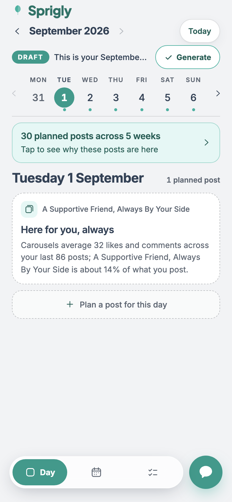
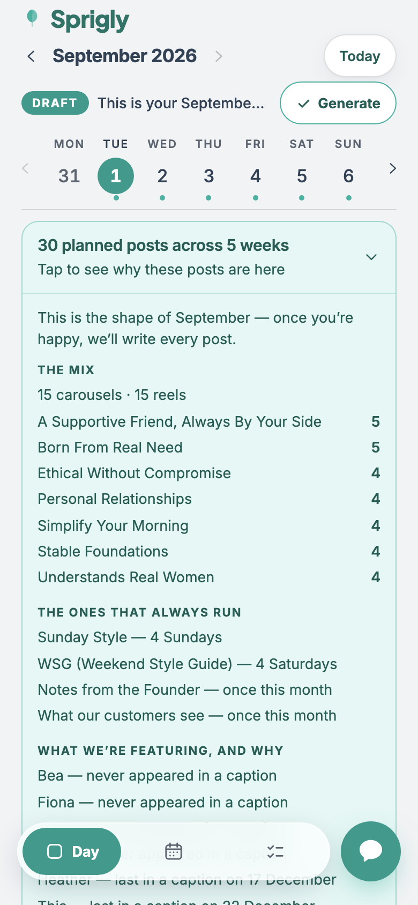
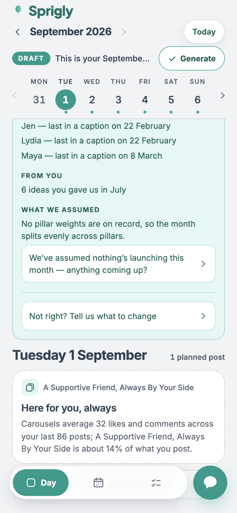
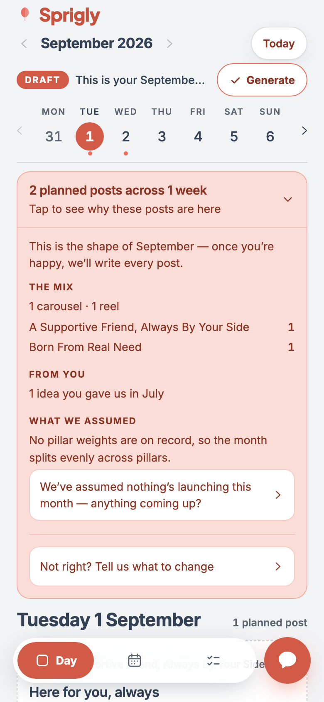

# The summary panel — weight, CTA, and the day's assumption strip

**Date:** 2026-08-03 · **Branch:** `dev`
**Adjusts:** [month-summary.md](./month-summary.md) — §2 of that report is superseded by §2 here.
**Acceptance target:** ivy-t cycle `0b9677e5-d06d-4de5-9207-527cd837333a`, September 2026, UAT.

| commit | piece |
|---|---|
| `9c3f400` | M4 (derivation) — the panel absorbs the whole assumption set, question included |
| `89d1ce7` | M1–M4 — the panel takes the tint, the CTA, and the day's assumption strip |
| `ad7bf88` | fix — the summary's lists carry no browser marker, and no 40px indent (§6) |

---

## 1. The rendered result, on the real month

390px, Chromium at DPR 2, against ivy-t's live September draft on UAT — the same 30 rows
[month-summary.md §1](./month-summary.md) reported, through a `next dev` pointed at the UAT
database and entered on an existing magic link.

### Closed



```
30 planned posts across 5 weeks
Tap to see why these posts are here
```

Two lines and a chevron, in the mint tint. The day's heading, its count and its whole first card
are on screen underneath, unclipped.

### Expanded — the head



The stage sentence opens it, then the derivation. Every pillar sits on one line with its count in
its own column (that alignment is §6's fix).

### Expanded — the foot



```
WHAT WE ASSUMED
  No pillar weights are on record, so the month splits evenly across pillars.
  [ We’ve assumed nothing’s launching this month — anything coming up?   › ]
  ─────────────────────────────────────────────────────────────────────────
  [ Not right? Tell us what to change                                    › ]
```

Statements first, then the two tappable rows together. Both sit on `surface` inside the tint, with
their own edge and a chevron — inside a tinted panel a tint-filled button would be invisible, so
what says "this one does something" is the fill, the border and the glyph rather than colour alone.

### The thin month

The same two REAL September rows — 1 and 2 September, copied verbatim out of UAT into a local
database built from the UAT schema — rendered by the same components. Nothing was written to UAT
to produce it.



```
2 planned posts across 1 week
Tap to see why these posts are here

This is the shape of September — once you’re happy, we’ll write every post.

THE MIX
  1 carousel · 1 reel
  A Supportive Friend, Always By Your Side     1
  Born From Real Need                          1

FROM YOU
  1 idea you gave us in July

WHAT WE ASSUMED
  No pillar weights are on record, so the month splits evenly across pillars.
  [ We’ve assumed nothing’s launching this month — anything coming up?   › ]
  [ Not right? Tell us what to change                                    › ]
```

Three sections instead of five: no series and no products in those two rows, so those headings are
not built. Singular throughout — "1 carousel", "1 idea", "1 week". Both prompts are still there,
which is the point: a thin month is the month that most needs telling us what is missing.

**That render is coral, not mint, and it is the strongest evidence for M1 that this session
produced.** The local database was built from the UAT schema and the two post rows; the `themes`
row was not copied, so the surface fell through to the coral fallback. The panel followed the
theme without a line of it being conditional — which is what "tokens only" means, demonstrated
rather than asserted.

---

## 2. M1 — the weight

The panel takes the `accent-100` tint the day's assumption strip used to hold. In this codebase
those tokens are named `coral-*` and resolve through `--t-*`; the active theme paints them mint.

| | before | now |
|---|---|---|
| panel fill | `bg-line-soft` | `bg-coral-100` |
| panel edge | `border-line/30` | `border-coral-600/45` |
| headline ink | `text-chrome` | `text-coral-800` |
| sub-line, sections, counts, chevron | `text-muted` | `text-coral-800` |
| internal dividers | `border-line/30` | `border-coral-600/25` |

`coral-800` on `coral-100` is the sanctioned ink pair (4.70:1, DESIGN.md §6). No ink carries alpha;
the only alpha is on borders. No new value and no hex — the tokens fence passes unchanged.

**The headline's wording and prominence are untouched:** still `30 planned posts across 5 weeks`,
still 15px/600 at the same tracking. Only its colour follows the tint, and that is pinned as a
test so "prominence unchanged" is a fact rather than a claim.

**This only became affordable because of M4.** Two tinted blocks on one screen — the panel at the
head and the strip at the foot — would have been two things claiming to be the system's voice.
Removing the strip is what makes the tint mean something.

---

## 3. M2 — the CTA, closed

**The chosen copy is "Tap to see why these posts are here."**

It is the brief's suggestion with two words added, and they are the two that matter. "Why these
posts" names a subject; "are here" names the question — the same question the beat sheet's
insights panel is headed with ("Why this one is here"), so the month's version and the post's
version rhyme. It stays in the client register: no jargon, and it says what opening it gets you
rather than labelling the control.

**The stage sentence moved inside**, and is now the panel's opening line:

> This is the shape of September — once you're happy, we'll write every post.

That is the right place for it on its own terms. It is the *answer* to "why these", not a caption
on the count — and the closed state now says one thing and offers one action, where before it said
two and left the chevron's job to be inferred.

**Closed, the panel is one `<button>` and nothing else** — asserted, not assumed. The chevron is a
state indicator on that control, not a second target.

### The cost, measured

| state | panel height at 390px | day heading starts at |
|---|---|---|
| closed | **98px** | y = 306 |
| expanded (September, 30 posts) | 1039px | y = 1247 |
| expanded (thin, 2 posts) | 514px | y = 732 |

Measured from the live render, not estimated. The closed panel is two text lines inside a 56px
tap-target floor plus padding; the expanded one is as tall as the month's evidence, and it scrolls
with the day rather than sitting above the scroll region, so it leaves the screen entirely once
read.

---

## 4. M3 — the CTA, expanded

The panel ends with **"Not right? Tell us what to change"**, after a divider, as the last thing in
the detail region. A question first, because it invites a no as readily as a yes.

**It opens the same conversation sheet the mic opens** — `setVoiceFor('')`, the identical call the
shell's mic button makes. No second interface and no second consequence to learn: on a draft month
that sheet reshapes the month directly and returns a receipt, and it does that whether it was
opened from the mic or from here. Pinned by asserting the sheet and its mic are both present after
the tap, and that it opens **empty** — the shaping prompt is an invitation to say anything, not a
question to answer.

**Absent on a month that can no longer be changed.** A prompt that can only refuse is worse than no
prompt, which is the same rule the Generate pill and the mic already follow on this surface.

---

## 5. M4 — the strip is gone, and the answer path is intact

### What moved

The strip rendered one assumption at the foot of the day, re-voiced as a question, tappable. It is
gone from `DraftDayPanel` entirely — the prop, the markup and its `ChevronR` import. The question
is now a row inside the expanded summary's `WHAT WE ASSUMED` section.

**Same predicate, same ranking, same wording.** `isAnswerable` still drops the ones that state a
fact about our data; `firstAnswerable` still ranks which single one is worth asking;
`assumptionPrompt` still supplies the words. None of those three functions changed. What changed is
that `monthSummary` calls them instead of `DraftSurface` doing it — the surface no longer picks an
assumption of its own, which is how the panel and the strip could have come to disagree about which
gap mattered.

### The answering path — verified, as asked

**It still routes through the intake apply, unchanged.** The chain:

```
[ We’ve assumed nothing’s launching this month — anything coming up? ]
        ↓  onAnswer(question)
  setVoiceFor(question)                                        DraftSurface.tsx
        ↓
  <VoiceSheet question={…}>  — the question renders as an agent TURN, never as sent text
        ↓  onSubmit(text, source)
  m.say(text, source)                                          useDraftMonth.ts
        ↓
  POST /api/plan/draft/apply  { op: 'text', text, source }     app/api/plan/draft/apply/route.ts
        ↓
  applyTextToDraft()                                           lib/draft-apply.ts
        ↓
  isDocumentShaped(text) ? applyBriefToDraft : applyIntakeToDraft
        ↓
  classifyIntake() → routing → the month, or the backlog with a rescue tap
```

`applyIntakeToDraft` is the intake apply, and it is reached exactly as before. The interaction test
that pinned this on the strip now pins it on the panel row, **asserting the identical request
body** — `{ op: 'text', text: 'The candle, on the 24th', source: 'web' }` — so a regression in the
routing shows up as a changed body rather than as a passing test on a dead prompt.

### Nothing became unanswerable

The brief asked me to stop and report if anything did. Nothing did, and the comparison is exact:

| assumption | before (day strip) | now (panel) |
|---|---|---|
| ranked-first answerable | question, tappable | question, tappable |
| other answerable ones | stated in the panel | stated in the panel |
| not answerable (our bookkeeping) | stated in the panel | stated in the panel |
| any of them, past cutoff | strip not rendered | stated, no question |

Every row is unchanged in what it offers. On ivy-t's September that means: "anything coming up?" is
still the one question, and "No pillar weights are on record…" is still a statement — which is what
the operator ruling (spec §2) decided when there was one slot to spend.

**One judgement call, stated rather than buried.** The strip had a single slot and that forced the
ranking. The panel has room and *could* ask every answerable assumption. It deliberately does not.
Asking a client three things at once is a different act from asking them one, and widening it is a
decision about how much to demand of them — not a consequence of moving a control. If that widening
is wanted it is a one-line change to the assumptions block, and it should be an explicit ruling.

---

## 6. What the acceptance render found

**One defect, mine, fixed in `ad7bf88`.** Tailwind preflight is disabled on this surface
(`globals.css` — it is disabled so the flag-off `PlanApp` is untouched, with a scoped reset instead).
So a bare `<ul>` keeps the browser's `list-style-type: disc` **and** its `padding-inline-start: 40px`.
On a 350px panel that indent pushed the longest pillar onto a second line and left its count
stranded beside the first — breaking the count column the section exists for. `list-none pl-0` is
load-bearing here, not tidying. Panel height fell from 1103px to 1039px as a side effect.

**One pre-existing defect, NOT fixed, reported instead.** The beat sheet's insights list has the
same problem, from last session's T1:

```
[data-testid="insights"] ul  →  { listStyleType: "disc", paddingInlineStart: "40px" }
```

It draws its own dot spans, so the browser's disc renders *as well*, and the 40px indent costs the
grounding lines a chunk of their measure — "WSG (Weekend Style Guide) — weekly; last ran 28 August"
wraps earlier than it needs to. It is the identical one-class fix. I have not applied it: it is
outside M1–M4, it changes a component this brief does not name, and it is the kind of thing worth a
deliberate yes rather than a quiet ride-along. Screenshot evidence is in the session; the fix is
`list-none pl-0` on `DraftDetailSheet.tsx`'s `ul`.

---

## 7. Gates

| gate | result |
|---|---|
| `pnpm --filter @sprigly/engine test` | **517 passed** — unchanged, no engine file touched |
| `pnpm --filter @sprigly/worker... build` | **exit 0** — the command Railway runs |
| `tsc --noEmit` (app) | clean, after every commit |
| app unit / interaction (**Node 22**) | **1273 passed**, 38 skipped (baseline 1259) — **+14** |
| ↳ `draft-rationale.test.ts` | 100 (was 96) |
| ↳ `draft-surface.interaction.test.tsx` | 101 (was 95) |
| ↳ `narrow.interaction.test.tsx` | 32 (was 28) — 375 and 320 |
| tokens fence | 10 passed |
| terminology fence | 8 passed |
| draft invisibility | 5 passed |
| detector (3 changed components) | **0 findings, exit 0** |

`git diff` on `*terminology.fence.test.ts`, `*tokens.fence.test.ts`, `*draft-invisibility.test.ts`
is **empty** — no fence moved this session.

**The baseline moved for a reason that is not mine.** `dev` now contains `df344bc` (a merge from
`uat`), which brought one more test file and 24 more skipped tests with it. Measured at HEAD with my
work stashed: **1259 passed, 38 skipped, 90 files** — so the +14 above is this session's, and the
skip count is untouched by it.

**The two pre-existing app failures are unchanged:** `edit-scope.test.ts` and
`post-generation.test.ts` fail to *collect* because they import a module that parses `DATABASE_URL`
at import time. Same two files, **0 test failures**. The worker's 11 failing integration files are
the same known baseline (301 passed, 38 skipped).

**Node 22 matters.** Under the default Node 20 the app run looks green while silently skipping every
jsdom file — which is every interaction test in this session.

### Audit of the changed components

| dimension | finding |
|---|---|
| Accessibility | The header is one `<button>` carrying `aria-expanded` and `aria-controls` at the region it opens, plus an `aria-label` saying what opening it gets you. The two prompts are real buttons at a 48px floor, each with its label as text and a decorative chevron. Facts are a real `ul`/`li` under a real `h3`; the count is text in its own cell and survives with styling off. |
| Theming | No new colour and no new token. Every value is a `coral-*`/`surface` key already on this surface, resolving through `--t-*`. Proved live: the same components rendered mint on UAT and coral on a database with no theme row. |
| Contrast | `coral-800` on `coral-100` is the sanctioned pair (4.70:1). No ink utility carries alpha — the tokens fence checks this and passes. The prompts sit on `surface`, raising their contrast above the tint rather than lowering it. |
| Responsive | Nothing fixed-width. Both prompts are `w-full` with `min-h-[48px]`, their labels `break-words` beside a `flex-none` chevron. Driven at 390 / 375 / 320, and measured at 390. |
| Integrity | One component changed, one prop and its markup removed from another, one derivation option removed. No new route, no new query, no new evidence field. |

**Nothing was written to UAT.** The September screenshots were taken by pointing a local `next dev`
at the UAT database and entering on an **existing, unexpired** magic link rather than minting one —
so the only trace is the `last_used_at` touch any client visit makes. The thin-month variant used a
throwaway local database built from the UAT schema plus two copied rows, dropped afterwards. No
draft was re-assembled and nothing was pushed.
